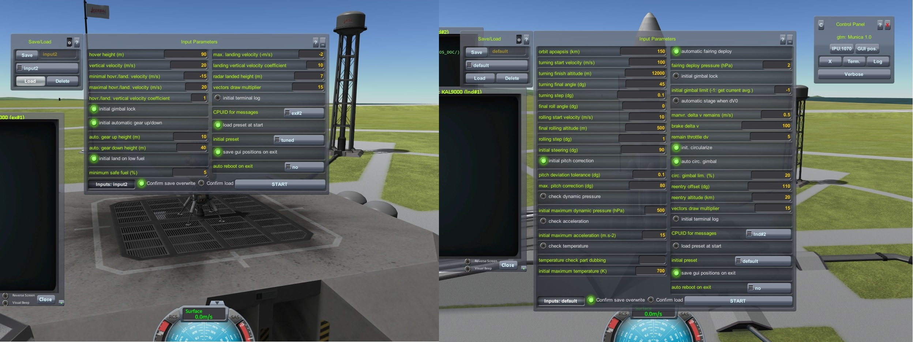
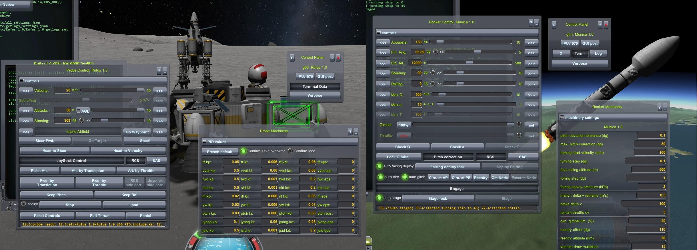
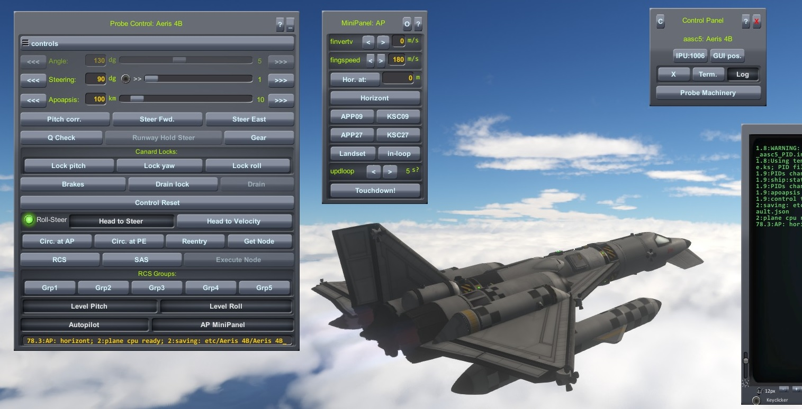
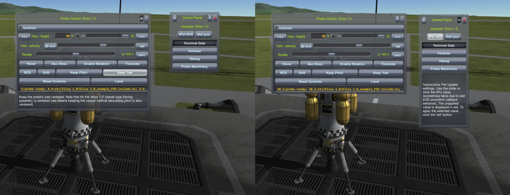
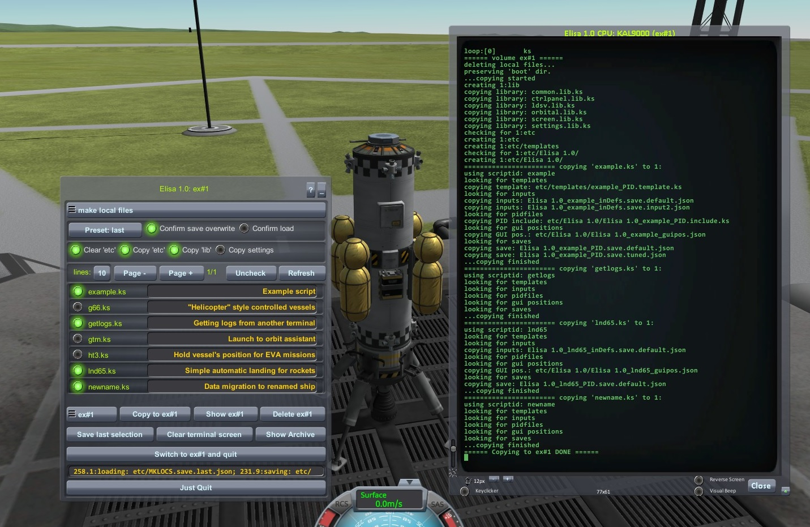
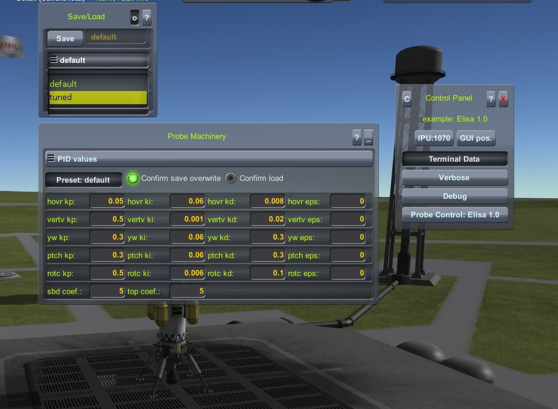
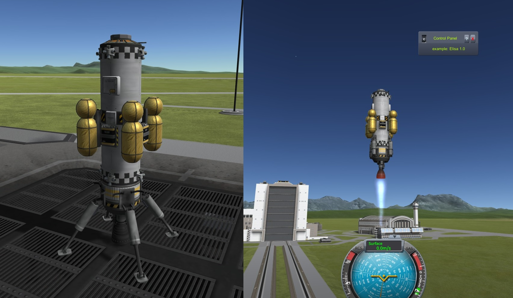
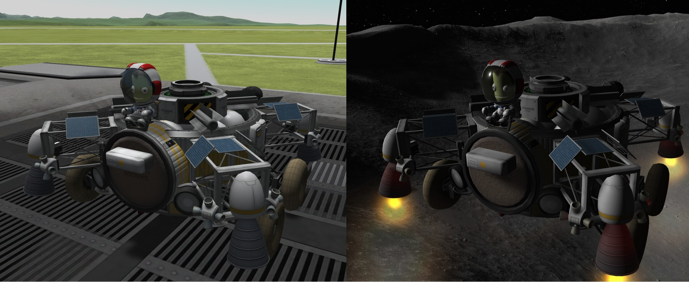
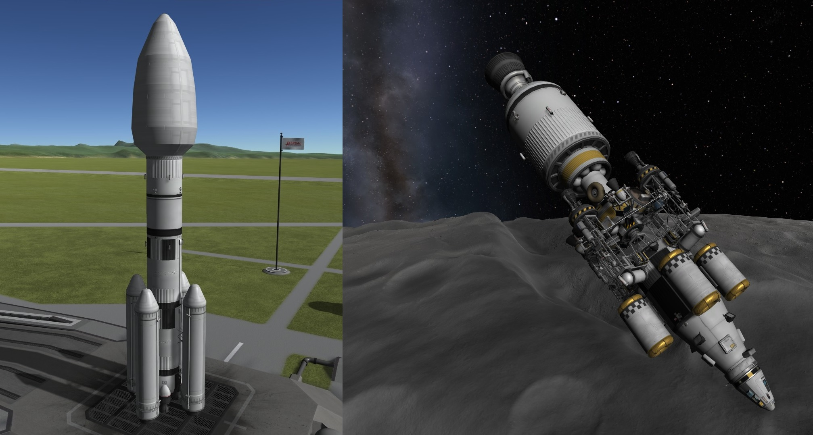

# kOS Control Panels Scripts

Control Panels (CP) is a set of kOS scripts and libraries that provide a relatively easy way to assemble functional GUIs for controlling loop-based kOS scripts. The scripts use stacks, buttons, sliders, and other graphical elements, along with options to save and load PID parameters (or any other values) as named presets. I've been writing and using these scripts for several years, and since I recycle them quite often, I figured they could be useful for other kOS enthusiasts as well.

Using and developing with CP scripts and libraries assumes prior knowledge of working with and programming in kOS, as well as programming in general. However, the code is not overly complicated, and if the comments and descriptions aren't enough, it can be easily reverse-engineered and adjusted to fit anyone's specific needs.

These scripts were written on the fly as I played, so some parts could certainly have been done better and made more universal. I've tried to optimize them and eliminate as many bugs as possible. The libraries and the `example.ks` script are commented with a reasonable level of detail for easier orientation.

Besides the description, there are demonstration videos available. The example script usage video is in the [example.ks](#exampleks) section. Videos of the rest of the included scripts in action are in the [Extras](#extras) section.

If you come across a bug or any other problem, or if you need more detailed information, feel free to contact me at ngx.ree [at] gmail [dot] com.

CP scripts require kOS version 1.5 or higher. The latest version can be found here:  
https://github.com/KSP-KOS/KOS/releases  
Of course, don’t forget about dependencies such as ModuleManager.

Older kOS versions have a bug (I believe it’s the one addressed in the “Invoke UI field change callbacks when settings fields” issue) which causes problems with the textfield onconfirm functionality.

An optional mod is Dunbaratu’s LaserDist, an extension of kOS capabilities that provides laser distance-measuring devices. The CP scripts package includes a vessel that uses this mod (along with one of the example scripts). However, if you don’t want to use it, there’s also a version of the vessel without distance meters attached.  
LaserDist can be downloaded here (it says it’s updated for KSP 1.11.x, but it works fine with 1.12.x too):  
https://github.com/Dunbaratu/LaserDist/releases/tag/v1.4.0

## Table of Contents
[SCRIPTS FEATURES](#scripts-features)

[INSTALLATION](#installation)
 - [Scripts installation](#scripts-installation)
 - [Directory structure](#directory-structure)
 - [Ships installation](#ships-installation)
 - [Notepad++ KerboScript language import](#notepad-kerboscript-language-import)

 [BEFORE YOU START](#before-you-start)
 - [Set your screen resolution](#set-your-screen-resolution)
 - [Instructions per update](#instructions-per-update)
 - [kOS HDD sizes](#kos-hdd-sizes)
 - [Script ID (`scriptid` variable)](#script-id)
 - [Templates and include files](#templates-and-include-files)
 - [Local ship files handling](#local-ship-files-handling)
 - [Usage considerations](#usage-considerations)
 - [Development considerations](#development-considerations)
 
[EXAMPLES AND TOOLS](#examples-and-tools)
 - [example.ks](#exampleks) - Example flight with example vessel
 - [getlogs.ks](#getlogsks) - Receiving messages from another terminal
 - [mkl.ks](#mklks) - Copying scripts from Archive to ship`s local volume
 - [newname.ks](#newnameks) - Renaming ship and/or migrating configurations from old name to new name
 - [Extras](#extras) - Scripts already usable in KSP gameplay
   - [g66.ks](#g66ks) - "Helicopter" style controlled vessels
   - [lnd65.ks](#lnd65ks) - Simple automatic landing for rockets
   - [ht3.ks](#ht3ks) - Hold vessel's position for EVA missions
   - [gtrn.ks](#gtrnks) - Launch to orbit assistant
 


## SCRIPTS FEATURES
- Graphical input parameters pane with pre-filled values. This pane is displayed on script start (unless inapplicable, like `getlogs.ks` or `mkl.ks`) and provides a means to enter and/or edit initial values for variables used within the functional parts of user scripts. The pane also provides the ability to save entered values as inputs automatically loaded at start, or even save various variants of inputs that can be easily selected and saved/loaded on script start.


- Basic Control Panel GUI, and more complex control multipanel GUIs with various controlling elements. These elements include combinations of buttons for easy increasing/decreasing of given values, popup menus to select various functionalities, textboxes for displaying messages and tooltips, etc. Complex panels can be minimized (hidden) and restored (shown again) to save screen space without affecting their operations, so the basic CP acts as a sort of task toolbar.


- Minipanels - purpose-specific compact panels that can be invoked/revoked, for example, by a toggle-type button. Minipanels usually contain sets of small control elements and help reduce the number of controlling elements on main panels, keeping them clear and much easier to navigate.


- Mechanism for easy tooltips usage to maintain descriptions of individual functions and control elements.


- A GUI-based tool for easily copying selected scripts and related files from the archive volume to the local ship volume(s).


- PID parameters (and/or any other scalar variables if needed) control panels for displaying/editing said parameters in real time during the flight. Edited parameters can be saved under arbitrary preset names and loaded whenever needed during flight or automatically at script start. Save/Load mechanisms are mainly focused on (but not limited to) various parameter sets - for example, different PIDs for the same vessel on different planets, etc.


- PID parameters (or other stuff if needed) stored in a separate `*PID.include.ks` file named by script ID and ship name combination. This file is easy to edit (in contrast to .json preset files) and serves as the source for PID parameters for a given script and ship. The file is initially created (after the first script run on a given ship) from a template for the given script.

- Basic orbital functions library for orbit circularization, orbit apsis change, maneuver execution, or crude reentry planning.

- Library for commonly used functions, like working with certain parts, helping with navigation, and any other stuff used across multiple scripts. Functions in this library will probably be mostly replaced and/or extended by users' own functions.

- CP scripts use kOS name tagging (dubbing) for individual parts to identify parts for certain actions. For example, engines named 'leng' identify "landing engines" where gimbal actions are performed, while other engines on the same vessel, not dubbed, are not involved in such actions. Naming of parts is set up in the VAB or SPH editor (right click → kOS → name tag:), or it can be done in flight as well in parts' right-click popup. Note that multiple parts should have the same name tag for given actions. For example, if the vessel has four landing engines, they all must have the name tag 'leng'. The exceptions are kOS processors, which should each have their own name so they can reference each other.

[back to TOC](#table-of-contents)

## INSTALLATION

The contents of the `ControlPanelScripts.zip` package are as follows:  

`Scripts` - Directory containing Control Panel scripts, libraries, and basic example configurations.  

`Ships/VAB` - Directory containing example vessels, described below.  

`images` - Directory containiong screenshots used in this README.  

`kOS_dark.xml`, `kOS_light.xml` - Notepad++ language definitions for KerboScript, dark and light versions.  

`README.md`, `LICENSE.txt` - This README and license information.  

### Scripts installation

Unpack `Script` directory contents into the kOS archive's `Script` directory, usually `[KSP installation folder]/Ships/Script/`. It's also a good idea to back up your `Script` directory beforehand, just to be sure.

### Directory structure

Directory structure of CP scripts adds two subdirectories to the kOS default directory:

`lib` - Subdirectory containing libraries which are included by `runoncepath` commands in main scripts.

`etc` - Subdirectory for saved settings and presets. By default, for each vessel running CP scripts, its own subdirectory in `etc` is created named by the vessel's name.

`etc/templates` - Contains templates for each script which will be used to create the initial `*PID.include.ks` file after the script's first start (the template is simply copied to the ship's subdirectory as a file with a given name following the ship-script naming convention).

`boot` - Standard kOS subdirectory containing scripts loaded on boot. The CP scripts package contains script 'archive.ks' which (when set as boot file) switches the terminal to archive filesystem after launch or switching to a given vessel. Its usage is optional, according to your preferences.


### Ships installation

Unpack contents of `Ships/VAB` into your save's `Ships/VAB` directory. This package contains example vessels to work with the included example scripts. All vessels were created using no part mods other than kOS and LaserDist. Vessels with the '-noLaser' suffix are variants without LaserDist mod parts.

'Elisa 1.0' - An example simple uncrewed vehicle, designed to run with the 'example.ks' script. It serves for demonstration of basic script usage and behavior.


'Rufus 1.0' - A single-seated vehicle for the 'g66.ks' script demonstration and testing. It uses a "helicopter" control scheme and monopropellant engines only. Best to use on the Mun. This vehicle also contains laser-based distance measuring units (there is also a version without them), used to prevent the flying vehicle from hitting steeply elevated ground during flight (experimental).


'Munica 1.0' - The rocket and the lander designed to get 'Rufus 1.0' to the Mun. It can use the 'gtrn.ks' script for launching to LKO and the 'lnd65.ks' script for Mun landing.


### Notepad++ KerboScript language import

There are two KerboScript language definitions in the package:
`kOS_dark.xml` - Definition for dark mode.
`kOS_light.xml` - Definition for light mode. This one is quite hastily derived from dark mode (because I use dark mode only), so it might need some additional adjustment.

To import KerboScript definition(s) into Notepad++, open Notepad++ and go to Language -> User Defined Language -> Define Your Language, then click the `Import` button and browse to `kOS_dark.xml` and/or `kOS_light.xml`. After the import, restart Notepad++ and find the language definition(s) under the `Language` menu item.

WARNING: I don't know if it is a Notepad++ bug or I have made some mistakes in the definitions, but sometimes (especially when working with comments) the code marking goes wrong from the cursor down (when it happens, you'll see it). Re-selecting the language from the menu fixes the problem.

[back to TOC](#table-of-contents)

## BEFORE YOU START

### Set your screen resolution
Before you begin working with scripts, set the parameters of your screen resolution in the `etc/settings.lib.ks` file. This is necessary for the initial GUI positions to be placed correctly.  
Open the file in a text editor and find the following section:

```
global currsets is lexicon(
"mainx",list(1920,"maximum x screen resolution"),
"mainy",list(1200,"maximum y screen resolution"),
```

Replace `1920` with your X screen resolution and `1200` with your Y screen resolution (if you know how to get actual resolution parameters directly in kOS, please let me know).
CP scripts use the global settings lexicon `currsets` (current settings) defined in the `settings.lib.ks` library. It contains the initial screen positions (some of them computed relative to other `currsets` settings, e.g., the screen's X and Y resolutions), box styles, terminal window width and height, some default colors, and some other default values.
Settings are either read from this lexicon (in the `settings.lib.ks` library), or can be overridden by a `*_settings.json` file. This is still experimental, so all you need for now is the `settings.lib.ks` library and you don't need to worry about it (besides the initial setting of screen resolution, as described above).

In case you do care about settings, here is more information:  
File `all_settings.json` replaces settings for all scripts regardless of `scriptid` and the vessel's name. This file is saved directly in the `etc` subdirectory. It is read first in the sequence.  
File `scriptid_settings.json` (where scriptid is the actual ID of a given script) replaces settings for the script with the `scriptid` identifier. This file is saved directly in the `etc` subdirectory. It is read second in the sequence.  
File `shipname_scriptid_settings.json` (`shipname` is the actual ship's name, scriptid is the actual ID of a given script) replaces settings for the script with the `scriptid` identifier running on the ship with `shipname`. This file is saved in the `etc/shipname` subdirectory. It is read third in the sequence.  
The library `settings.lib.ks` (which must be included first, at the beginning of each CP script) looks for all settings files in the given order and prints 'File not found' if the file is not there. That is not an error message.  

### Instructions per update
kOS has limitation settings that control how many instructions are run per KSP update. The more instructions, the smoother the script runs (more instructions are performed) at a certain cost to KSP performance. The default IPU value is 200, which is quite low for kOS scripts using complex GUIs (you can literally see them redrawing). Please use higher values, at least 500 or as many as your PC can handle. The IPU can be changed in kOS settings, or from within scripts (all but `getlogs.ks` and `mkl.ks` have a button for it).

### kOS HDD sizes
When placing kOS processors on your vessel, use full HDD sizes for kOS CPUs. The KAL9000 with a fully upgraded disk is the best option. Libraries are quite long and they contain a lot of comments. If needed, you can mass remove comments (e.g., using Notepad++) to decrease file sizes.

### Script ID
Each script must have its `scriptid` variable set to the script's name (without .ks extension). The `scriptid` variable is crucial for file operations (configurations, settings, saves and loads) to work correctly.

### Templates and include files
If no template for a given script exists in the 'etc/templates' subdirectory, the script creates an empty include file in the ship's configuration subdirectory and then crashes (since it contains undeclared variables). This file must be manually edited before it works. If the script was run on the ship's local volume, obviously, this file is created on that local volume. Then, it must either be edited with the kOS editor ('edit filename.' command) or copied to the archive (or created under the same name), edited in any text editor and copied back to the local volume. To avoid this hassle, it is good to make sure at least the template is always present for a given script.

### Local ship files handling
`mkl.ks` script  
For scripts running on the ship's local filesystem, all necessary libraries and settings need to be copied from archive, along with the script itself. To easily copy scripts from archive to local filesystems, use the GUI-based `mkl.ks` script, usage described [below](#mklks).

`newname.ks` script  
It is crucial for the ship's saved and configuration files to be placed under the correctly named subdirectory with correctly constructed filenames. If you want to rename your ship, or the ship is renamed by KSP, for example, after undocking or separation, use the simple interactive command line utility `newname.ks`. This utility automatically migrates all the ship's configuration into the new location. The utility's usage is described [below](#newnameks).

### Usage considerations
There is a known kOS GUI bug that occurs when changing the geometry of a GUI window. When it is resized (for example, by switching between stacks) from bigger to smaller, the dimensions of the draggable area remain the same as the original window. For example, if the Machinery stack (which is quite long) is displayed, and you switch to the much smaller PID stack, you can still grab the window and drag it by its now invisible bottom. Also, if this invisible area overlaps another GUI window, you cannot click on that window although you can see it. The only way to get to the bottom window is to move the problematic window to the side, or minimize (hide) it.  
Currently, there is no known solution for this bug.

Scripts do not work well with the 'RemoteTech' mod due to long-distance time delay. The kOS GUI reacts to button presses as if they were issued remotely even if the button press is invoked from within the script (which is used pretty often). Hence, waiting for the time delay will occur every time the function is invoked by a `set buttonname:press to true.` call somewhere in the code. Of course, for usage over short distances, where delay is minimal, scripts work well (Minmus is the furthest I tested). Also, crewed/droned vessels work correctly regardless of distance.

Setting some parameters during script run to certain values can be fatal, since it can invoke invalid operations. For example, an attempt to divide by zero or calling a function out of its bounds. Not all variables are checked for validity, although setting those variables to invalid values usually does not make sense.

Losing some part during the flight (e.g., after bumping into something) can cause the script to crash, if it refers to lost parts. Not all parts are checked for presence constantly.

### Development considerations
Some library functions rely on the presence of global variables in main script, so do pay attention to the naming of your own global variable identifiers. Always check if they are not already present and used in some of the libraries. If you use an existing variable identifier in global context, script(s) may not work as intended. Of course, you can use library global variables for your purposes. For example, `screen.lib.ks` uses `on` triggers for checking RCS and SAS status change to toggle 'RCS' and 'SAS' buttons if defined, presuming they are created as global variables named `rcsbtn` and `sasbtn` respectively.  
For example, you can use the Notepad++ 'Find in Files' function with descent into subdirectories to check for the presence of variables. Check used library function comments (and code itself) for more information.

kOS remembers some variables set within the script after it ends. This can mislead you when you change your code and re-run the script. Certain variables can seem to be defined and the script will not crash due to their non-existence (referring to a variable before it was created). The safest (but also annoying) way to avoid this is to reboot the kOS terminal (with the `reboot.` command), so do it from time to time to check if all variable declarations are in order (if you know a better way please let me know. I know there is the `unset` command, but unsetting all variables one by one is not really a good way).

If you change your 'input_data' lexicon in your script, don't forget to delete the `*inDefs.save.default.json' file in your ship's configuration directory. This file is created automatically and loaded at the script start, which would override new values in the changed 'input_data' lexicon.

[back to TOC](#table-of-contents)

## EXAMPLES AND TOOLS
### example.ks
Script `example.ks` briefly demonstrates typical CP script functionality and behavior. Its functions are described and commented within the code. It is designed to run with the 'Elisa 1.0' vessel and can serve as a template or a base for developing your own scripts. Comments in `example.ks` code focus on GUI elements mainly, not particularly on the flight's functionality (although there are some).

Example scenario below serves to help you get oriented with the script's typical usage.  
See video: https://youtu.be/rCYHRaqUNvQ

Although I think you would figure out the script's behavior and usage just by watching the video and/or reading tooltips (revealed by toggling the `?` button and hovering the mouse cursor over a given control element), it's worth testing it step-by-step as described below, at least for the first time you try the script. It will help you understand how CP scripts work before you start making your own.

The example demonstrates creation and usage of:  
- Input pane with pre-filled values along with means to save/load various inputs.
- GUI elements for controlled hovering, ascent/descent, translation and rotation of the 'Elisa 1.0' vessel.
- Stacked multi control panel.
- Minipanel for horizontal translation control.
- Display and editing of PID parameters and some other values in real time during the flight with means to save/load them as various named presets.

IMPORTANT WARNING!  
If you set all yaw, pitch, roll and translation to 0, the main throttle also goes to 0 and it is not possible to set it to a non-zero value within the script (more precisely, setting `ship:control:mainthrottle` to anything doesn't give a ...). I don't know whether it is some kOS bug, or a feature I don't understand.  
Also pay attention when setting some values, as not everything is checked for validity (for example, this can cause division by zero which makes the script crash).

NOTE that this script works well only with the 'Elisa 1.0' vessel type (facing UP, like a rocket), especially translation control due to it facing upwards. For this example case, the subdirectory `etc/Elisa 1.0` already exists, because it holds an example PID preset (named `tuned`). For new vessels which do not have their configuration directory present yet, the directory is created automatically after the script's start.

#### NAME TAGS
kOS name tagging on the 'Elisa 1.0' vessel is as follows:
- 'leng' - Main liquid fuel engine uses the gimbal lock feature.
- 'solpan' - Solar panels for the extend/retract function.
- 'ex#1' and 'ex#2' - Two kOS processors, each with its own name, used for directing log messages from one to another.

#### 1. LAUNCH THE VEHICLE
- Make sure you saved your screen resolution parameters ('mainx' and 'mainy' keys of `currsets` lexicon) in the `etc/settings.lib.ks` file. See [this](#set-your-screen-resolution) section for details.
- Launch the 'Elisa 1.0' vessel from the VAB, activate the main engine (stage).
- Optionally, use cheat (alt+F12 -> Cheats -> Infinite Propellant), if you want to experiment without taking care about fuel consumption. Otherwise, the vessel will automatically (try to) land if fuel goes under 5% (default).

#### 2. OPEN TERMINAL(S)
- Open both terminal windows ('ex#1' and 'ex#2'). Action group 0 has a toggle set on both of them, so you can press 0 to open/close them. NOTE that 'ex#2' will open on top of 'ex#1', so move it with the mouse.
- Make sure both terminals are switched to the archive filesystem. Run the `list.` command to see its content. The listing must contain `etc` and `lib` subdirectories, as well as `example.ks` script. This example uses the `boot/archive.ks` boot script, so both terminals should already be on the archive. To run scripts from the vessel's local filesystem, scripts and libraries must be copied from the archive. The best way is to use the `mkl.ks` script to copy them automatically along with all related configuration files and subdirectories (see description of `mkl.ks` usage [below](#mklks)).  
For this example test, we will run everything from the archive. The 'Elisa 1.0' vessel is equipped with a basic omnidirectional antenna, so the archive volume will be available at the KSC launchpad.

#### 3. RUN THE SCRIPT
- In the 'ex#1' terminal, run the command `run example.`. Two GUIs will be created: a basic 'Control Panel' GUI in the top right screen corner and an 'Input Parameters' GUI in the middle of the screen.
- Check input parameters. Press the `?` button in the top right corner of the 'Input Parameters' pane. A tooltip display box will be shown at the bottom of the pane. Hover the mouse over input prompt labels to display tooltips (prompt descriptions) in that box. For now, don't change any values.
- Press the `START` button. The 'Input Parameters' pane will be dismissed and the 'Probe Control: Elisa 1.0' multipanel will be displayed in the top left screen corner.
- Press the minimize (`_`) button in the top right corner of the multipanel. The multipanel will be hidden and the basic 'Control Panel' GUI will get a new button 'Probe Control:Elisa 1.0'. Press that button to show the controls multipanel again.
- Press the compact button `C` on the panel's top left corner. The basic control panel is compacted and shows only the title and top buttons bar. Click `c` again (when compacted, the button is in lowercase), and the panel is restored. Of course, this can be used with all multipanels minimized, so the compacted basic control panel can be the only part of CP scripts displayed, while still providing functionality.
- Since this script does not have a ship-specific `*PID.include.ks` file yet, it will be created from the `etc/example_PID.template.ks` file. A green popup message will appear in the center of the screen. Press `OK` to dismiss it.

#### 4. OPTIONALLY WATCH LOG MESSAGES
- Optionally, if you want to watch log messages in the 'ex#2' terminal window, do the following (otherwise you can close the 'ex#2' terminal, we will not need it):
- In the 'ex#2' terminal, run the command `run getlogs.`. You can move GUIs with the mouse if they are obstructing each other.
- Click the popup menu selector on top of the 'Probe Control' multipanel. Select `switches` stack. The panel will switch itself from `controls` elements to `switches` elements.
- Turn the `Terminal logs` checkbox ON and make sure the popup selector next to the checkbox shows 'ex#2'. This option can also be set in the 'Input Parameters' pane and saved as inputs so that logging is active automatically.
- Optionally, once you're here, extend solar panels with the `Ext./Retr. Solar Panels` button. NOTE that solar panels must be kOS tagged (named) 'solpan' for this function to work.
- Switch back to the `controls` stack using the popup selector on top of the multipanel.

#### 5. FIRST HOVER
- Press the `Hover` button. Note that `Hovr. height` (first controls line) is set to 50 m. The vessel will lift off and finally will maintain its height 50 m above the ground.
- The buttons `Keep Pitch` and `Keep Yaw` are turned on automatically.
- Note that the first ascent to hovering was far from smooth. PID parameters must be adjusted to address this issue. In this example, a PID preset `tuned` was prepared and copied to the vessel's configuration subdirectory `etc/Elisa 1.0`. Press the `Land` button on the 'Probe Control' panel. The vessel will land (again, not very smoothly). After landing, all controls including buttons are reset.

#### 6. ADJUST PID PARAMETERS
- Press the `Probe Machinery` button on the basic 'Control Panel' GUI. The `Probe Machinery` GUI will be displayed.
- Click the popup menu selector (on top of the pane, with `machinery settings` on it) and select `PID values`. The PID parameters stack will be displayed.
- Press the `Preset: default` button, the `Save/Load` minipanel will appear above the pane.
- Click the popup selector under the `Save` button and select the `tuned` preset. Press `Load` and note that the first PID parameters line (`hovr kp:`) changed.
- Untoggle (press again) the `Preset: default` button, the `Save/Load` minipanel will be dismissed. Minimize the `Probe Machinery` GUI by pressing the minimize (`_`) button in its top right corner.
- Press `Hover` to check hovering with the new PID parameters. The vessel will ascend and maintain hovering much more smoothly.

#### 7. CREATE/CHANGE PRESET
- Open `Probe Machinery` -> `PID values` again. We will create a new (changed) preset.
- If you want, change some PID parameter values as you wish (be careful not to crash the vessel).
- Press the `Preset:tuned` button to open the `Save/Load` minipanel.
- Press the `Save` button. The textbox next to it will become enabled. Write your own preset name and press enter (or click outside the box, kOS behavior...). The new preset is saved.
- Use the popup selector under the `Save` button to select any available preset, press the `Load` button to load it anytime, press the `Delete` button to delete the selected (not necessarily loaded) preset.
- Note that all presets are actually .json files in the vessel's configuration subdirectory (`etc/Elisa 1.0` in this case).

#### 8. HOVERING CONTROL
- Use the left `<<<` and right `>>>` buttons on the first line `Hovr. height` to change the vessel's height. Use the slider (on the left of the `>>>` button) to change the increment. Alternatively you can write the value directly to the line's edit box. Note that after a manual edit of this value, the first click on the `<<<` or `>>>` button will not have an effect. This is due to a specific kOS behavior related to the textfield's 'onconfirm' functionality.
- Toggle the checkbox (with `>>` label, left of the increment slider) to show/hide the vessel's orientation and movement vectors.

#### 9. VERTICAL VELOCITY CONTROL
- Note that the `Vert. velocity` line shows a default setting of 20 m/s. Press the `Asc./Desc.` button to initiate vertical velocity control. The vessel will start an ascent and will maintain 20 m/s vertical velocity (the last m/s can take a bit longer to adjust, play with PID parameters to tune it if you want).
- Use the `Vert. velocity` line slider to set a new value (negative values mean descent). When you move the slider, the new value is displayed in red color. It means it is not effective yet. Press the `set` button to make it happen.

#### 10. ROTATION CONTROL
- Press the `Hover` button to get the probe to its hovering height again.
- Use the `Rotate` line's slider to set horizontal axis rotation. Positive value is counter-clockwise rotation, negative is clockwise. Press the `zero` button to set rotation to 0 rad/s.
- Toggle the `Enable Rotation` button to enable/disable rotation control. Note that if you disengage this button, rotation will not stop (while inertia is in effect).
- Optionally use the `RCS` button (or in-game controls) to turn RCS on/off.

#### 11. TRANSLATION CONTROL MINIPANEL
- Toggle the `Translate` button to create/dismiss the `Horiz. translation` minipanel. Its initial position is next to the 'Probe Control' GUI on its right side.
- Note that the 'pin' button (`o`) on the minipanel is pressed. This means the minipanel will always be created in its initial position next to the 'Probe Control' GUI. Close the minipanel (untoggle the `Translate` button) and move the 'Probe Control' GUI to a new position. Press the `Translate` button again. The minipanel will be created next to the 'Probe Control' GUI again.
- Untoggle the minipanel's pin button and close the minipanel with the `Translate` button. Move the 'Probe Control' GUI and open the minipanel again. It will be created in its last position. To reset this behavior, toggle the pin button.

#### 12. TRANSLATION CONTROL, TRANSLATE VESSEL
- Make sure the vessel is hovering and stable. Open `Horiz. translation` with the `Translate` button.
- Toggle the `>>` checkbox on the `Hovr. height` line to show the vessel's vectors. This will help you observe the translation.
- The 'Elisa 1.0' vessel translation can be controlled along `ship:facing:starvector` and `ship:facing:upvector` vectors. Note that since the vessel is actually facing upwards, its `facing:upvector` is oriented horizontally.
- Translation is not controlled by PID loops. RCS control values (interval -1,1) are computed as the difference between actual and planned velocity respectively. To adjust these differences (for both horizontal vectors), coefficients are used as multipliers (the bigger the value, the faster the change). These coefficients can be edited and saved/loaded along with PID parameters in the `PID values` stack (`sbd coef.` and `top coef.` fields), as described previously.
- You can close and open the `Horiz. translation` minipanel without affecting the actual translation. It will always be created with the currently used values. Note that minipanels are not just hidden when not opened, they are deconstructed and then constructed again. This helps to save the kOS CPU resources, on the other hand, it is a little pain in the ass to reference their elements within the code.

#### 13. LANDING
- To land the vessel, simply press the `Land` button. The script will first automatically set rotation and translation to 0 and then will slowly land the vessel on the ground (it waits for the translation to stop, but not for the rotation). Landing gear is controlled automatically. This can be enabled/disabled in the `switches` stack of the 'Probe Control' multipanel using the `Autom. gear` checkbox.

#### 14. EXIT SCRIPT
- To finish the script, click the red `X` button on the top right corner of the basic 'Control Panel'. Under the panel's title, two buttons appear, `Exit` and `Cancel`. Pressing `Exit` correctly ends the script. GUI positions are saved, all GUIs are destroyed and lexicons are cleared.

#### 15. SAVING INPUTS
- Run the `example.ks` script again with the command `run example.`
- On the 'Input Parameters' pane, change some values, for example, set `hover height` to 90, check the `load preset at start` checkbox and select the intended preset, for example, `tuned`. Don't press `START` yet.
- Press the button in the low left corner of the pane, its label starts with `Inputs:`. The `Save/Load` minipanel is displayed next to the pane on the top left corner.
- Press the `Save` button and enter your inputs name in the enabled textbox, for example, `input2`. Confirm with enter.
- Press `START`, the script runs with new input values. Exit the script.

#### 16. USING SAVED INPUTS ON START
- Run the `example.ks` script again with the command `run example.`
- To load saved inputs, press the `Inputs:` button to create the `Save/Load` minipanel. Similarly to loading PID presets, select `input2` input and press `Load`. The saved values are shown on the 'Input Parameters' pane.
- Press `X` on the basic 'Control Panel' and then press `START`. The script will immediately exit.
- To run the script with saved inputs without having to load them from the 'Input Parameters' pane, run the script with the input name as a CLI parameter. For example, `run example("input2").` will immediately start the script with the saved `input2` input and will not wait for the `START` button.
- To delete inputs, press the `Delete` button on the `Save/Load` minipanel.
- To run the script with automatically used default inputs you can obviously run `run example("default").`, but for loading 'default' inputs, the parameter can be any value which evaluates to TRUE. For example, `run example(1).`. Also, if you enter an input name which does not exist, the script loads 'default' inputs instead (it is the same as `run example(1).` or `run example(true).`).

#### OTHER FUNCTIONS
##### `switches` stack - additional options
On the `switches` stack of the 'Probe Control' multipanel there are the following options:
- 'Lock Gimbal' option locks the gimbal of 'leng' dubbed engine(s). Locking the gimbal helps with flight stability as KSP does not try to engage gimballing in addition to gears and RCS.
- 'Land when low on fuel' option controls automatic landing initiation when the vessel's fuel amount goes under a certain value (5% by default, this can be changed either in the 'Input Parameters' or in the `machinery settings`).
- `Autom. gear` option controls automatic gear retract/extend functionality for hovering/ascending (does not work for descending with `Asc./Desc.`) at a certain height. Height values for both retract and extend can be changed either in the 'Input Parameters' or in the `machinery settings`. Changing the option is effective BEFORE hovering/ascending is initiated.
- `Terminal logs` option controls sending logs ('statmsg' command defined in the `settings.lib.ks` library) to another kOS terminal window. The target window must be selected in the popup selector next to the checkbox. The target terminal must be running the `getlogs.ks` script to display messages.
The `Ext./Retr. Solar Panels` button toggles solar panels. These panels must be dubbed 'solpan' and must have extend/retract capability of course.

##### Probe Machinery - changing input parameter values
Press the `Probe Machinery` button on the basic Control Panel. Select `machinery settings` from the popup selector. This stack contains values of variables set up on the 'Input Parameters' pane. You can change them during the flight with immediate effect. Press the tooltip button (`?`) to see their descriptions. Tooltips are linked to descriptions on the 'Input Parameters' lexicon, so if you change them there, they will show new descriptions here as well.

##### IPU - instructions per update
IPU settings can be changed in KSP's kOS settings, but if you need to change them on the fly during the flight, press the button whose description starts with `IPU:` on the top of the basic Control Panel (the number following ':' is the current IPU value). Pressing the button shows the `IPU` minipanel above the Control Panel with the same functionality as described for `Vert. velocity` above.
Note that very low IPU makes script-controlled flight very unstable.

##### GUI positions - configuring GUI screen position saving
CP scripts save the last GUI positions and selections after the correct exit. Pressing the `GUI pos.` button on the top of the basic Control Panel shows a minipanel which allows selecting/deselecting the `Save on Exit` option, saving current positions with the `Save Positions` button (this will automatically deselect the `Save on Exit` option so that positions are not overwritten on exit) and deleting saved positions with the `Delete Positions` button (this will revert GUI positions to the default settings and, of course, it also deselects the `Save on Exit` option).

##### Terminal output - show or hide data printed in terminal windows
The control panel contains buttons `Terminal Data`, `Verbose` and `Debug` which allow various output to be printed in the terminal window running the `example.ks` script.
- `Terminal Data` button turns on/off all terminal data output with the exception of the first line (`OPCODESLEFT` shows how many instructions are available in addition to the already executed instructions - the more the smoother the script runs, `curtime` shows the number of seconds from the script's start, `loop` shows how many seconds the script's main loop took - the smaller the smoother). Turning terminal output off helps with performance when the script is very demanding.
- `Verbose` button shows additional data that are not normally needed during the flight.
- `Debug` button shows even more data, usually needed for debugging purposes.
Both `Verbose` and `Debug` buttons have no effect when `Terminal Data` is off.
See the script's code for information on how this data is displayed. The displaying section is placed at the end of the main loop (the `until scriptend {...}` section).

[back to TOC](#table-of-contents)

### getlogs.ks
Script `getlogs.ks` is a simple tool which serves to receive and display messages from other kOS terminals. Messages to be displayed are sent by the kOS command `processor(cpu)connection:sendmessage(msg)`, and CP scripts have already implemented a means to simplify that (function `statmsg(message)`).
The script has only a basic control panel with a single functional button `Clear Screen` which does exactly what it says.

[back to TOC](#table-of-contents)

### mkl.ks
Script `mkl.ks` (make locals) is a simple GUI-based file manager for copying scripts and related files from the kOS archive to the vessel's local volume. It scans the kOS `Script` directory for *.ks files and displays them on a GUI pane, where they can be selected/deselected by checkboxes.  
Selected files can then be copied to the vessel's local filesystem. Libraries and related settings are copied automatically.

The subdirectory `lib` is always copied with all CP libraries. Filenames of CP libraries are listed in the `cplibs` list, declared at the beginning of the `mkl.ks` script. This ensures omitting any other files occasionally present in the `lib` directory (for example, if the user used the `lib` directory before installation of CP scripts). If a newly developed user library should be copied to local volumes as well, its filename must be added to the `cplibs` list.

The subdirectory `etc` is copied only with configuration subdirectories and files related to the given script(s) and vessel.

If the vessel has more than one kOS processor, the `mkl.ks` script can see all of them and copying can be done for each of them independently. This allows you to have different scripts on different kOS local filesystems.

The script also allows saving/loading various selections under named presets.  
Presets can contain short descriptions for each script, in addition to selections. Descriptions are also shown as tooltips when hovering over the script's labels. This is useful especially for descriptions longer than the related textfield.  
The `mkl.ks` script looks for the 'last' preset when it starts. That preset can be created as some "quicksave" by clicking the `Save last selection` button. If the 'last' preset is not present, the `mkl.ks` script looks for the 'default' preset (and creates it if it does not exist).

Since the `mkl.ks` script is not ship-specific, it does not create any subdirectory in the `etc` directory and has its settings (like saved presets) directly in the `etc` directory instead.

`mkl.ks` multipanel contains two stacks:  

`make local files` - controls file operations between the kOS archive and the vessel's local volumes.  
- The first section provides means for save/load operations of selection presets.  
- The second section contains copy options for particular subdirectories and settings files. See tooltips for more info.  
- The next section shows a (paginated) list of .ks files present on the kOS archive volume with selection checkboxes and description editing textfields. The next section shows a (paginated) list of .ks files present on the kOS archive volume with selection checkboxes and description editing textfields. Note that the `mkl.ks` script itself is omitted as it makes no sense to copy it to local volume(s).
- The last section contains functional buttons for particular file operations. The volume popup selector offers to select any of the ship's available volumes as a target for copy operations. The `Save last selection` button provides a "quicksave" for the 'last' preset (automatically loaded on script start). See tooltips for information about other button functions.

`settings` - allows operations with settings files.  
- The first section allows construction of the settings file path. The `ship ID` and `ship directory` fields are pre-filled with the current ship's data (can be edited, but you must know what you are doing). The `settings file` selector offers all three settings file types. The `script ID` field needs to be edited for a given script whose settings will be created/edited.  
- The second section (`filename:`) shows the current settings file path.  
- The next section provides means to display, edit, add or delete particular settings items, as well as saving and deleting the settings file itself.  
The `settings` stack of the script is still in BETA.

Script usage example and description:

- Launch the 'Elisa 1.0' vessel.
- Open the terminal window of the 'ex#1' kOS CPU and make sure you are on the archive volume.
- Run the `run mkl.` command. The script's GUI opens. This script does not use a basic control panel, just one multipanel with two stacks.
- Toggle the tooltips (`?`) button in the top right corner for more detailed information about particular functional elements when needed.
- Click the popup menu selector to select the `make local files` stack, if not already selected.
- Use the popup selector (first item in the line right below the scripts list) to select the 'ex#1' volume. Since the `mkl.ks` script was started from the 'ex#1' volume, it should already be selected.
- Click the `Show ex#1` button. The contents of the 'ex#1' volume are recursively listed in the 'ex#1' terminal window. Most probably it will show nothing but the `boot` directory and its contents.
- Click the `Clear terminal screen` button. This will perform the `clearscreen` command on the 'ex#1' terminal window.
- Click the `Show Archive` button. The content of the archive volume are recursively listed in the 'ex#1' terminal window. If the list length exceeds the window height (actually about 80% of it), the listing will stop and wait for a keypress.

IMPORTANT: To continue (or quit) listing by pressing a key, the terminal window must be active, which means it must be selected. While waiting for a keypress, the `mkl.ks` GUI will not respond, although some clicks are cached.

- Clear the terminal window again.
- Select the checkboxes next to the `example.ks` and `newname.ks` labels. This selects the given scripts for copying.
- Make sure the `Copy etc` and `Copy lib` options are selected.
- Click the `Copy to ex#1` button and confirm the action (copying always deletes the destination volume, except for the `boot` subdirectory. The `etc` subdirectory can also be preserved if the `Clear etc` option is unchecked). The copy process is displayed in the 'ex#1' terminal window. If the operation is successful, the last line shows 'DONE'. If it has failed for some reason, it shows 'FAILED'.
- Clear the terminal window again.
- Clicking the `Show ex#1` button lists the 'ex#1' volume. It shows scripts and related files copied by the previous action.
- Use the volume selector to select the 'ex#2' volume.
- Click the `Uncheck` button (the line above the scripts list) to clear the current script selection.
- Select the `getlogs.ks` script.
- Click the `Copy to ex#2` button to copy `getlogs.ks` to the 'ex#2' volume. Note that action button labels are updated whenever a volume is selected to reflect the currently selected item.
- The 'ex#2' volume now has the `getlogs.ks` script and can be used for log reception from scripts running on 'ex#1'.
- Select the 'ex#1' volume again.
- Click the `Switch to ex#1 and quit` button. The `mkl.ks` script exits and the terminal is switched from the archive to the local 'ex#1' volume.

[back to TOC](#table-of-contents)

### newname.ks

`newname.ks` is a simple command line utility (no GUIs) which updates the ship's configuration directory and files in case the ship's name was changed. The change could be invoked either by the user renaming the ship, or by the separation/undocking process, when KSP adds something to the original name, like "probe", "rover" etc.

Also, the `newname.ks` utility itself can be used to rename the ship and migrate in a single run.

The main function is to migrate the ship's old configuration directory and files to a new one either by moving or copying (if you need to preserve old files for whatever reason).

`newname.ks` can be run both on a local volume or on the archive (if it runs on the archive, it warns you about it).

The usage is as follows:

If the ship's name was changed (by any KSP action) and you want to update (migrate) configurations:  
- Run the `run newname.` command.

If you want to change your ship's name and update configurations in a single step:  
- Run `run newname("ship-name").`, where `ship-name` is the ship's new name.

Next:  
- If there is a single configuration directory (normal local volume state, a single ship should have a single configuration directory), `newname.ks` automatically selects this directory for migration.
- If there are more directories (either it is run on the archive, or there are old backups on the local volume), the utility shows a list and asks for selection (write the number and press enter). Note that this list is not paginated.
- In the next step, you can either copy or move configurations, or quit the utility without any changes.
- Obviously, it makes no sense to change the name to the same name. If either the utility is run without a new name parameter before the ship was renamed, or the selected source configuration directory has the same name as the ship, `newname.ks` exits without any changes.

[back to TOC](#table-of-contents)

### Extras

Extras are CP scripts which I use in my KSP gameplay and are in a relatively ready state to be published. There can still be some bugs, but I tried to make sure none of them cause a script crash.  
Their usage is not extensively described; see tooltips for more info about particular functions. Keep in mind that some functions are still experimental.

In demonstration videos scripts are run directly from the archive, because no connectivity manager for kOS was used for this purpose. If you do use a connectivity manager, use 'mkl.ks' to copy scripts to local volumes and run them from there, to prevent loss of archive availability.

#### g66.ks

Video: https://youtu.be/f1AUAyBpHhQ

The `g66.ks` script is designed for 'Rufus 1.0'-type craft. It uses a "helicopter" style of steering where movement is achieved and controlled by the tilt of the craft.  
'Rufus 1.0' has two control points, a dock (for connection to the lander) and a command seat for the pilot.  
For the script to work properly, control must be set up from the command seat.  

The Mun is the best place to test `g66.ks` with 'Rufus 1.0'. You can get there (and back) with the 'Munica 1.0' rocket, or you can simply cheat it by Alt+F12 -> Cheats -> Set Position to save time.

##### NAME TAGS
kOS name tagging for the `g66.ks` script is as follows:
- 'solpan' - Solar panels to be extended/retracted, either manually or automatically.
- 'leng' - Main engines, in this case dubbed for gimbal control (lock).
- 'wheel' - Wheels, for friction control.

If laser distance meters are used:
- 'lsrl' - Left laser Dist-o-meter
- 'lsrm' - Middle laser Dist-o-meter
- 'lsrr' - Right laser Dist-o-meter

See tooltips for more information.

[back to TOC](#table-of-contents)

#### lnd65.ks

Video: https://youtu.be/ofdBmzOd3yQ  
Video: https://youtu.be/Llo3L24wVLc (Actually, the script was not designed for the full descent procedure, just for the final phase, but it works sometimes anyway...)

This is simpler script for the landing procedure. The vessel's control point must be facing upwards (like a rocket). For example, if you want to use it with 'Rufus 1.0', it must be controlled from the docking port.

The landing process is active only if the vessel's vertical velocity is negative (it is descending/falling) and the pilot throttle is 0. This means you can control the vehicle by manually throttling up and return to automatic landing by setting the throttle down to 0. In practice, if you land on a spot you don't like, don't exit the script, just throttle up and fly away a bit. Then throttle down to 0 and let the vehicle land. Of course, this assumes you have enough fuel and sufficient height.

The landing process can also be suspended manually with the `Suspend` button.

##### NAME TAGS
kOS name tagging for the `lnd65.ks` script is as follows:
- 'solpan' - Solar panels to be extended/retracted, manually in the `switches` stack.
- 'leng' - Main engine(s) used for landing. This dubbing is mandatory for the script to work.
- 'wheel' - Wheels (if present), for friction control.

See tooltips for more information.

[back to TOC](#table-of-contents)

#### ht3.ks

Video: https://youtu.be/NoR-erH7154

Script `ht3.ks` (hold target) is most useful in rendezvous (undocked) situations, where it secures a constant distance between the vessel and its target (e.g., the second vessel). For example, if you go EVA from your rocket to fix an orbital telescope, you can run this script on your ship with the telescope as a target and you don't have to worry it will drift away.

The script also has elements to control translation and rotation of the vehicle for some position fine-tuning. It normally uses a "raw" method for position holding (and movement) control, which means it adjusts controls based on the difference between the actual and desired coordinates. There is also an experimental method available, which uses PIDs, but I never succeeded in setting them correctly. However, the PIDs are there so you can experiment. PIDs for translation and rotation are prepared too, but they were never used (yet).

The script supports switching between targets. If no target is selected, it exits immediately.

NAME TAGS
kOS name tagging for the `ht3.ks` script is as follows:
- 'solpan' - Solar panels to be extended/retracted, manually in the `switches` stack.

See tooltips for more information.

[back to TOC](#table-of-contents)

#### gtrn.ks

Video: https://youtu.be/KNcqBPugePw

Script `gtrn.ks` provides gravity turn and other functions for rockets launched to orbit. It is designed to take care of the flight from launch until circularization. There is also a function for quite crude reentry planning to reach KSC (try changing the geo offset if you land too far).  
Staging is semi-automatic. It relies on a zero delta-v value for the given stage, so it does not work for stages with combined engines. In that case, staging must be done manually.

Of course, the control direction must be upwards.

To launch the rocket, first press the `Engage` button, then stage (or check the `auto stage` checkbox).

The script does NOT use automatic warp (yet).

NAME TAGS
kOS name tagging for the `gtrn.ks` script is as follows:
- 'solpan' - Solar panels to be extended/retracted, manually in the 'switches' stack.
- 'leng' - Main engine(s), in this case dubbed for gimbal control.
- 'fairing' - Payload fairing, tagged for automatic deployment
- `Tpart` - This is a variable containing the kOS tag of the part, which can provide temperature readings (e.g., 'fairing'). It is used to reduce the thrust when overheating and its value is set up in the 'Input Parameters' pane (or in 'Rocket Machinery'). The "Critical Temperature Gauge" mod is needed for this functionality to work.

See tooltips for more information.

[back to TOC](#table-of-contents)

